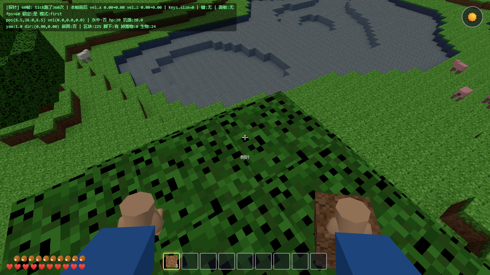
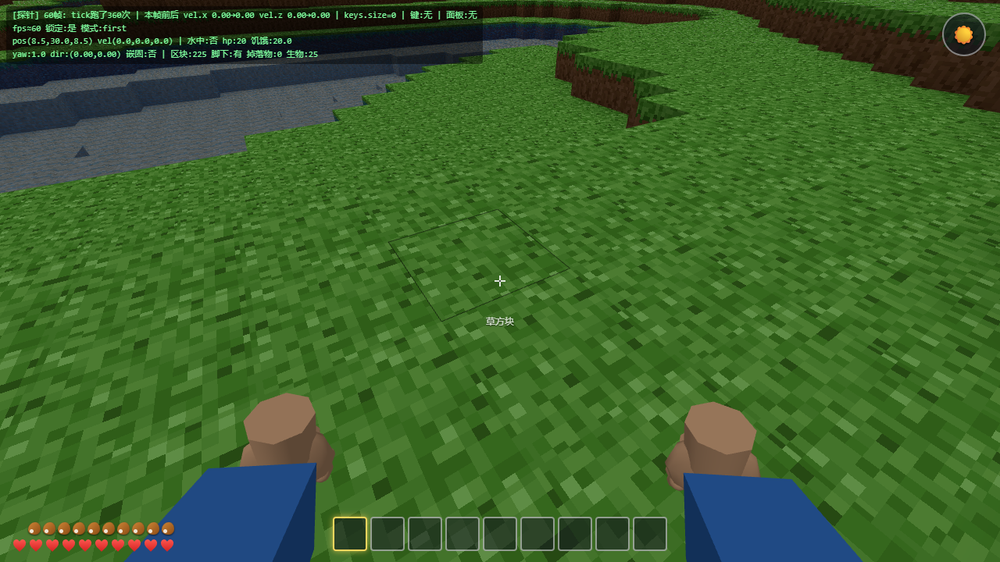

# 迷你世界 · Mini World

网页版 3D 体素沙盒游戏 —— **中国地图选区 · 34 省级行政区风土世界** / 掘地建造 / 资源合成 / 熔炉冶炼 / 昼夜生存 / 狩猎战斗，**零外部素材**（纹理程序化生成、音效 WebAudio 实时合成；选区地图内嵌简化省界数据，来源 [DataV.GeoAtlas](https://geo.datav.aliyun.com/)）。

   

## 快速开始

```bash
npm install
npm run dev        # 打开浏览器 http://localhost:5173
```

首次启动（或清档后）会先进入**像素风中国地图**选区——点选任意一个省级行政区（23 省 + 5 自治区 + 4 直辖市 + 2 特区），进入属于它的风土世界。

## 操作说明

| 输入 | 动作 |
|---|---|
| WASD | 移动 |
| 鼠标 | 视角（点击画面锁定指针） |
| 空格 | 跳跃 / **水中上浮（可蹿出水面跳上岸）** |
| Shift+W | 疾跑（消耗饥饿） |
| Shift（水中） | **下潜**（水底 / 冰面下探索；水中不按键会自动漂浮在水面） |
| **左键单击** | 攻击生物（左右拳交替出拳，命中显示血条）/ 按住挖掘方块（裂纹+碎屑特效）；挖到的方块**自动进背包**（手持位为空时直接入手，立刻可放） |
| **右键** | 放置方块（手持空时会**自动取出**背包里的可放置方块；**水中也能放**，替换水源）/ 吃食物 / 开工作台 / **开熔炉** / **按住拉弓蓄力、松开发射** |
| 1~9 / **滚轮** | 切换热栏（切换时手中物品抬起展示一下） |
| E | 背包 + 2×2 合成 + **护甲装备区** |
| **V** | 切换第一 / 第三人称（第三人称带走路摆臂动画，装扮可见） |
| **ESC** | 暂停菜单（继续 / 设置 / **扮 装** / **切换区域** / 重新开始本世界 / 保存退出） |
| P | 手动保存 |

## 实机截图

| 第一人称五指手（空手自然半握） | 手持方块（挖到即拾回，可立即放置） |
|---|---|
|  |  |

- 掉落物带**水浮力**：掉进水里的东西会浮到水面等你捡；磁吸垂直范围放宽到 2.5 格，水底 / 坑底 / 台阶上下都顺手
- 手部表现：五指手按持物类型自动切换**握姿**（扣握方块 / 捏持物品），走路摆臂、静止呼吸，出拳左右交替

## 中国区域世界

进入游戏前先在**像素风中国地图**上点选区域（悬停查看各地特色），34 个省级行政区各自拥有独立的地貌、植被、动物与天空氛围，并且都有**标志性建筑**（世界生成时确定性放置）：

### 直辖市
| 区域 | 标志建筑 | 特点 |
|---|---|---|
| **北京** | 四合院 + 宫殿 + **天坛祈年殿** | 华北平原、国槐行道树、烤鸭美食 |
| **天津** | 五大道小洋楼 + **天津之眼** | 海河滨城、跨河摩天轮 |
| **上海** | 石库门 + **东方明珠** | 都市平原、三球串联电视塔 |
| **重庆** | **洪崖洞吊脚楼群** + 解放碑 | 山城雾都、檐下灯火成排 |

### 省（按地理）
| 区域 | 标志建筑 | 特点 |
|---|---|---|
| **河北** | **赵州桥**（敞肩石拱） | 华北平原 + 太行山脚 |
| **山西** | **应县木塔**（八角五层全木） | 黄土高原沟壑、晋中大院 |
| **辽宁** | **沈阳故宫大政殿**（八角重檐） | 辽河平原 |
| **吉林** | **朝鲜族青瓦民居** | 长白山山地（起伏最大） |
| **黑龙江** | **圣索菲亚教堂**（绿洋葱穹顶） | 林海雪原、湖面结冰、稀有东北虎 |
| **江苏** | **苏州园林**（月洞门 + 水池 + 假山） | 江南水乡烟雨 |
| **浙江** | **雷峰塔**（八角五层赭红） | 西湖山水、龙井茶田 |
| **安徽** | **徽派马头墙民居** | 皖南山区白墙黛瓦 |
| **福建** | **圆形土楼**（夯土环 15 格径） | 闽地山海、椰林棕榈 |
| **江西** | **滕王阁**（三重绿琉璃） | 赣鄱丘陵 |
| **山东** | **孔庙大成殿** + 胶东海草房 | 泰山海岸、重檐歇山 |
| **河南** | **少林塔林**（台基上塔群） | 中原沃野 |
| **湖北** | **黄鹤楼**（五层攒尖 + 飞檐翘角） | 千湖之省江雾 |
| **湖南** | **岳阳楼**（黄琉璃盔顶）+ 湘西吊脚楼 | 湘西山地 |
| **广东** | **广州塔**（细腰格构）+ 骑楼街 | 岭南湿热、棕榈芭蕉 |
| **海南** | 骑楼老街 + 高脚屋 | 热带海岛、椰林最密、孔雀 |
| **四川** | 川西民居 + **乐山大佛**（依山坐佛） | 竹林雾盆、🐼 大熊猫 |
| **贵州** | **甲秀楼**（浮玉桥三重檐）+ 苗寨吊脚楼 | 苗岭云雾 |
| **云南** | 傣族竹楼 + **崇圣寺三塔** | 热带梯田、孔雀、大象 |
| **陕西** | **大雁塔**（七层方砖塔） | 关中平原 + 秦岭 |
| **甘肃** | **嘉峪关**（关城 + 长城两翼） | 河西走廊大漠、驼队 |
| **青海** | **塔尔寺八宝塔**（一排八座白塔） | 青海湖高原湛蓝 |
| **台湾** | **台北101**（竹节退台）+ 闽南红砖古厝 | 中央山脉、燕尾脊 |

### 自治区与特区
| 区域 | 标志建筑 | 特点 |
|---|---|---|
| **内蒙古** | **蒙古包** + **敖包**（石堆彩旗） | 一马平川大草原、马群 |
| **广西** | **程阳风雨桥**（三座鼓楼亭）+ 干栏木楼 | 喀斯特峰林、漓江青 |
| **西藏** | **布达拉宫**（白宫红宫金顶群） | 雪域屋脊、牦牛 |
| **宁夏** | **108 塔**（阶梯三角白塔阵） | 塞上江南 + 腾格里沙缘 |
| **新疆** | 绿洲农庄 + **苏公塔** | 大漠绿洲、葡萄棚架、骆驼 |
| **香港** | **中银大厦**（三棱水晶）+ 高层住宅 | 维港高楼、太平山 |
| **澳门** | **大三巴牌坊** + 葡式粉彩小楼 | 葡式碎石路、极平缓 |

- **随时换地图**：暂停菜单（ESC）→「切换区域」→ 重新点选 → 自动清档进入新区域世界
- 每个区域世界由 seed 确定性生成（`cn_<区域>_<随机>`），同 seed 必得同一世界；旧格式存档完全兼容（含旧「东北」区域存档）
- 标志建筑为**稀有生成**（每个 32×32 cell 约 2% 概率锚点），探索时留意天际线；常见民居建筑密度更高
- 区域特色元素通过**挖掘 / 狩猎**获取：竹子掉竹笋（可食可种）、芭蕉叶掉芭蕉、葡萄藤掉葡萄、孔雀掉羽毛……

## 玩法循环

1. **徒手砍树** → 原木 → 合成木板 / 工作台 / **木剑**（8 格圆石合成**熔炉**）
2. **白天狩猎**：各区域成群的特色动物——击杀掉生肉（可食用）、皮革、羊毛；动物受击会逃跑，血条实时显示
3. **熔炉冶炼**：粗铁 / 粗金 + 燃料（煤 80s / 木板 15s / 木棍 5s）烧成**铁锭 / 金锭**；生肉烧成熟肉（回复更多饥饿）
4. **铁器与弓箭**：铁剑（伤 9）/ 铁镐（挖金矿）/ 铁斧；木棍+木板做**弓**、铁锭+木棍做**箭**（孔雀毛+木棍也可）——按住右键蓄力，松手放箭（满蓄伤害 ×4.5）
5. **护甲防身**：皮革套装 / 铁质套装，头盔+胸甲每点护甲减 4% 怪物伤害
6. **角色装扮**：暂停菜单 →「扮 装」——肤色 / 上衣 / 裤子 / 头发四色自定义 + 4 款预设皮肤，即改即存
7. **游泳**：落水后自动**漂浮在水面**（不按键不下沉），空格上浮蹿跳、Shift 下潜，入水豁免摔落伤
8. **生存**：饥饿归零掉血到 1；吃肉 / 苹果 / 区域美食回复；满饥饿自动回血；夜晚刷怪
9. **存档**：世界改动 / 背包 / 装备 / 熔炉进度 / 所选区域每 10 秒自动保存（+ 退出时 + P 键），随时继续
10. **旅行打卡**：34 省各有标志性建筑（祈年殿 / 布达拉宫 / 土楼 / 东方明珠……）稀有生成在世界中——换区域探索，集齐各地标；**建筑材质都可拆建**（汉白玉 / 红砖 / 琉璃 / 黛瓦 / 茅草……挖掉即掉落可放置物品，拆别人的牌坊也能砌自己的墙）
11. 摔落伤害、卡方块自救、掉出世界自动送回、防把方块放进自己身体——都替你想好了

## 技术架构

```
体素引擎   Chunk 16×64×16 · Uint8Array · 逐面剔除网格化 + AO 顶点色
区域系统   区域编进 seed 前缀（Worker 协议零改动）· 34 省级行政区参数表（data/regions/ 分组模块）
           真实省界矢量中国地图选区（DataV 简化内嵌 + 墨卡托投影 + 悬停高亮）· 模块级活动区域状态
地形生成   simplex fbm 大陆/丘陵/山脊/温度噪声 · 区域参数化（基准/振幅/阈值/梯田/强制群系）
植被       8 种树几何（橡/槐/竹/云杉/胡杨/棕榈/茶/芭蕉）· 叶冠半径≤2 跨 chunk 不断枝
结构生成   32×32 cell 确定性哈希锚点 · **51 种建筑 stamp**（world/buildings/ 分组模块，
           只读哈希+地形公式，跨 chunk 逐位一致）· anchorMargin 按结构半径自适应（≤8）
物理       分轴扫掠 AABB（玩家/生物/掉落物/箭矢共用求解器，子步防穿墙）· 浮力游泳
           掉落物水面浮力上浮 + 磁吸拾取（垂直容差 2.5 格，水底/坑底/台阶上下可捡）
世界调度   流式加载（帧预算 ≤2 chunk/帧）· diff 记录 → localStorage 存档 v2（含区域字段）
Worker     terragen+mesher 全量入 Web Worker（transferable 零拷贝 + 三重同步降级）
渲染       Three.js · 全局仅 2 材质 · 视距 6 chunks ≈113 区块 · 60fps · 区域天空/雾/水色 tint
生物       物种数据表驱动（9 物种：猪/牛/羊/熊猫/大象/孔雀/马/骆驼/虎）· 三态 AI · 区域权重刷怪
           怪物人形模型（方头/前平伸双臂/走路摆腿摆臂，脚底锚对齐物理 AABB）
熔炉       燃烧热值 + 烧炼进度（MC 语义）· 状态随存档持久化
投射物     弓蓄力曲线 → 箭实体（重力弹道 · 子步命中 · 插墙可捡回）
战斗       近战贴身锥形兜底 · 装备护甲减伤（每点 -4%，上限 20 点）
美术       启动时 canvas 程序化生成 108+ tile 图集 · 物品/掉落物真实图标
           第一人称五指手：握姿切换（扣握方块/捏持纸片）· 走路摆臂 · 手持物方块/纸片模型
音效       WebAudio 六音效实时合成（挖/放/受伤/吃/拾取/点击），无素材文件
UI         全 DOM overlay：像素中国地图/热栏/背包(装备区)/合成/熔炉/血条/蓄力条/昼夜钟/暂停菜单/装扮页/诊断 HUD
测试       vitest 966 用例，引擎层纯函数全覆盖（含跨 chunk 结构一致性硬闸 · 34 区逐区确定性
           · 挖取→掉落→拾取→放置数据闭环穷举）
```

## 开发方式

本项目采用**多 Agent 波次化并发**开发（波内多 Agent 并发：文件所有权互斥 + 契约先行，波末串行集成冒烟）：

- 基础版：28 张任务卡分 11 个波次，详见 [docs/EXECUTION_PLAN.md](docs/EXECUTION_PLAN.md)
- **34 省扩展**：8 个波次（W0 契约波 → W1-W6 分地理组分波 → W7 终验），任务卡见 [docs/tasks/w0-contract.md](docs/tasks/w0-contract.md) ~ [w7-final.md](docs/tasks/w7-final.md)

- 设计文档：[docs/architecture.md](docs/architecture.md)
- 接口契约：[docs/contracts/interfaces.md](docs/contracts/interfaces.md)
- 协作规则：[docs/contracts/conventions.md](docs/contracts/conventions.md)
- 任务卡：[docs/tasks/](docs/tasks/)

## 构建与测试

```bash
npm test        # vitest run，966 测试
npm run build   # tsc 类型检查 + vite 生产构建（含 worker chunk）
npm run preview # 预览生产构建
```

### 扩展一个新区域（现有 34 区已全覆盖，新定制流程）

1. `src/data/regions/parts/<组>.ts` 加一条 `RegionDef`（地形参数 / 树表 / 结构表 / 动物权重 / 氛围色）——`index.ts` 聚合导出自动生效
2. 选区地图：34 省已由真实省界数据（`src/ui/chinaGeo.ts`，DataV GeoAtlas 简化内嵌）矢量渲染，新区域无需改图；`regionPickerData.ts` 的硬校验会自动把关数据完整性
3. 标志建筑：`src/world/buildings/<组>.ts` 写 stamp 函数（工具见 `buildings/kit.ts`，铁律见 `docs/contracts/buildings.md`）；kind 类型与四张配置表在 `data/regions/index.ts` 与 `world/structures.ts` 登记一次
4. 需要新方块时走三点注册：`blocks.json` → `registry.ts BLOCK` 表 → `atlas.ts`（ATLAS_TILES + PAINTER_TABLE）；若要可挖可放，再在 `items.json` 配 `ITEM_*` 掉落物品——`tests/dig-place-loop.test.ts` 会穷举校验这条数据闭环
5. `tests/regions/<组>.test.ts` 补特征断言（确定性 / 群系 / 特征方块）——结构与跨 chunk 一致性测试由 `tests/structures.test.ts` 按 REGIONS 表自动派生，无需手写
